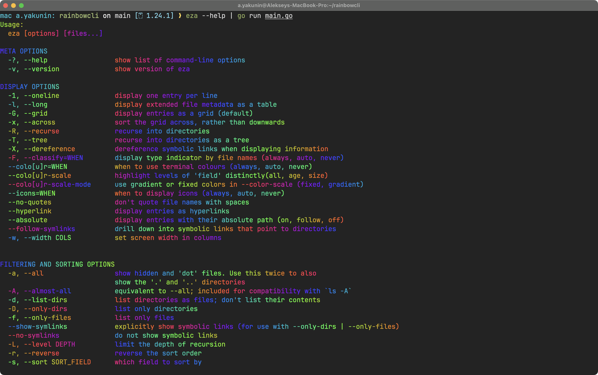

# RainbowCLI



RainbowCLI is a simple command-line utility that applies a rainbow gradient to text input from a pipe. It reads input from stdin and prints it to stdout with colorful formatting using ANSI escape codes.

## Features
- Reads input from standard input (stdin)
- Outputs the text with a smooth rainbow color effect
- Uses ANSI escape codes for color formatting
- Works in Unix-based terminals that support 24-bit colors

## Installation

### Build from Source
Ensure you have Go installed, then run:

```sh
git clone https://github.com/yourusername/rainbowcli.git
cd rainbowcli
go build -o rainbowcli
```

## Usage 

Since RainbowCLI works with pipes, you can use it as follows:

```sh 
echo "Hello, World!" | ./rainbowcli
```

or with other commands:

```sh
cat file.txt | ./rainbowcli
```

If you try to run the command without a pipe, it will display a usage message.

## Example Output

When run in a terminal that supports true color, you will see a smoothly colored rainbow text output.

## License

This project is licensed under the [MIT License](./LICENSE). See the [LICENSE](./LICENSE) file for details.
Contributing

Feel free to open issues or submit pull requests to improve the project.

## Author 

Created by Aleksey Yakunin.
